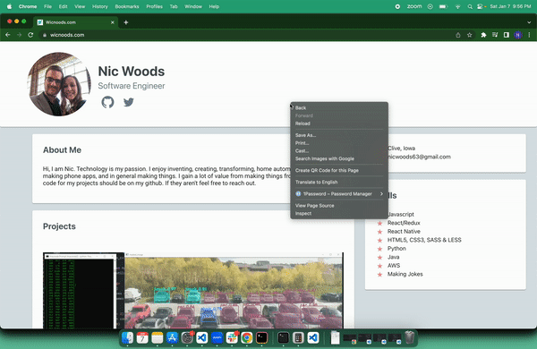

## Diddle chrome extension

On Slack huddles, when someone is sharing their screen, other members have the ability to doodle, or draw on that users screen and it slowly fades away.

Inspired by this, I wanted to make a chrome extension that allowed me to draw over any screen, and when done have it fade away just like Slack!

- Hold down control
- Click and hold for 2~3 seconds
- Release and begin to draw!
- Click again to remove the text

There might be issues with detecting the key # between mac/windows

